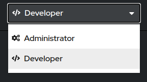

<p align="center"><a href="../aula01">❮ Aula anterior</a> | <a href="../aula03">Próxima aula ❯</a></p>
<br/>

# Aula 2 - Consoles do OpenShift
Nesta aula, aprenderemos sobre o console do OpenShift, tanto a versão web (GUI) quanto a linha de comando (CLI). A maior parte do curso será feita a partir da linha de comando, mas vamos também apresentar o console gráfico fornecido pela web.

## O console web
O OpenShift fornece uma interface gráfica para gerenciamento do cluster e das suas aplicações. As opções disponíveis são definidas por política de acesso, que são gerenciadas por usuários administradores do cluster. O acesso padrão de um cluster é o de desenvolvedor, no qual acesso total é liberado nos projetos criados pela conta de desenvolvedor. As contas administradores têm acesso a todos os projetos e recursos de todo o cluster. O OpenShift fornece uma série de formas de login, desde OAuth2 integrado com GitLab ou GitHub até usuários fixos criados para autenticação básica através do htpasswd. 

Ao fazer login no console web do OpenShift, o usuário verá a lista de projetos aos quais ele tem acesso. Caso o usuário não tenha processos criados, ele será direcionado ao dashboard no cluster, que mostra detalhes da saúde e dos recursos do cluster. 

<figure>
  
  <figcaption>Imagem 1.1 - Informações do projeto</figcaption>
</figure>

Ao selecionar um projeto, você verá os recursos disponíveis nele, gráficos de utilização, detalhes e atividade do projeto.

<figure>
  
  <figcaption>Imagem 1.2 - Página do projeto</figcaption>
</figure>

Podemos ver as informações, atividades e eventos do projeto a partir desta tela. A contagem de recursos que nosso projeto tem, o que está acontecendo no momento e recursos de cluster disponíveis ficam todos listados nesta tela. Através da barra lateral, podemos nos guiar para ver diferentes recursos. Administradores têm opções adicionais de recursos disponíveis, como configuração do cluster, projetos e pods que contas de desenvolvedores não podem ver. 

<figure>
  
  <figcaption>Imagem 1.3 - Barra lateral do administrador</figcaption>
</figure>

Como desenvolvedor também podemos selecionar o modo Developer da interface web. Ela também mostra informações do projeto, mas de forma mais técnica. 

<figure>
  
  <figcaption>Imagem 1.4 - Selecionando o modo desenvolvedor</figcaption>
</figure>

A página inicial na visão de desenvolvedor, por exemplo, mostra a topologia do projeto, as aplicações existentes nele e como elas se comunicam. As opções da barra lateral mudam também.

<figure>
  
  <figcaption>Imagem 1.5 - Barra lateral do desenvolvedor</figcaption>
</figure>

Podemos, por exemplo, abrir a tela de monitoramento da aplicação, que mostra gráficos de utilização, métricas e eventos. Outras opções existem também na barra lateral, muitas delas já existentes no modo administrador, como Builds, Config Maps, Secrets e informações do projeto.

<figure>
  
  <figcaption>Imagem 1.6 - Home page do desenvolvedor</figcaption>
</figure>


<figure>
  
  <figcaption>Imagem 1.7 - Página de monitoramento</figcaption>
</figure>

## A linha de comando
O OpenShift fornece muito controle sobre o cluster e o projeto através da interface web, mas a linha de comando é ainda mais poderosa. Através da linha de comando podemos também criar projetos, aplicações, diferentes recursos e até mesmo gerenciar o cluster inteiro caso tenhamos permissões de administração. 

As informações não ficam dsponíveis facilmente como na interface web, mas o controle sobre elas é maior na linha de comando. Além, claro, de alguns recursos não serem disponíveis através da interface web.

A linha de comando do OCP usa o binário `oc`, que tem subcomandos e manuais dos subcomandos para fazermos tudo isso. O OCP também é compatível com o `kubectl`, o binário da linha de comando do Kubernetes. Apesar de ser preferível usar o `oc`, pessoas familiarizadas com Kubernetes podem usar comandos que os deixam mais confortáveis.

Para ter acesso ao cluster, é necessário fazer login. Com a interface visual, campos de login são exibidos (o OCP suporta diversos tipos de autenticação, desde OAuth2 até LDAP ou o simples HTPASS), mas com a linha de comando é necessária uma sintaxe específica.

```bash
oc login -u usuario -p senha https://console.cluster
```

Caso o usuário e a senha fornecidos sejam corretos, você terá acesso liberado ao cluster de acordo com suas permissões de usuário. Para ter uma visão geral dos projetos, podemos usar:

```bash
oc projects
You have one project on this server: "exemplo".

Using project "exemplo" on server "https://console.cluster".
```

Para ter informações gerais de um projeto, podemos usar o comando `describe`. Ele é usado não somente para projetos, mas também para diversos outros tipos de recursos que o OCP oferece. 

```bash
oc describe project exemplo
Name:		exemplo
Created:	27 minutes ago
Labels:		<none>
Annotations:	openshift.io/description=
		openshift.io/display-name=
		openshift.io/requester=thales-ibm-com
		openshift.io/sa.scc.mcs=s0:c77,c34
		openshift.io/sa.scc.supplemental-groups=1005920000/10000
		openshift.io/sa.scc.uid-range=1005920000/10000
Display Name:	<none>
Description:	<none>
Status:		Active
Node Selector:	<none>
Quota:		<none>
Resource limits:
	Name:		exemplo-core-resource-limits
    Type		Resource	Min	Max	    Default Request	Default Limit	Max Limit/Request Ratio
    ----		--------	---	---	    ---------------	-------------	-----------------------
    Container	cpu		    -	4	    5m		        1500m		    -
	Container	memory		-	6Gi	    50Mi		    2Gi		        -
	Pod		    cpu		    -	4	    -		        -		        -
	Pod		    memory		-	12Gi	-		        -		        -
```

Vamos entrar em mais detalhes de comandos específicos nos próximo capítulos. Ao decorrer do curso, usaremos muito mais a linha de comando, então prepare-se! Refira-se aos links de referência para documentação e guias de como usar a interface web ou a linha de comando.

## Referências
* [Documentação do OpenShift](https://docs.openshift.com/)
* [Acessando a console web](https://docs.openshift.com/container-platform/4.5/web_console/web-console.html)
* [Configurando a console web](https://docs.openshift.com/container-platform/4.5/web_console/configuring-web-console.html)
* [Iniciando com a linha de comando](https://docs.openshift.com/container-platform/4.5/cli_reference/openshift_cli/getting-started-cli.html)
* [Comandos do OpenShift](https://docs.openshift.com/container-platform/4.5/cli_reference/openshift_cli/developer-cli-commands.html)


----
<p align="center"><a href="../aula01">❮ Aula anterior</a> | <a href="../aula03">Próxima aula ❯</a></p>